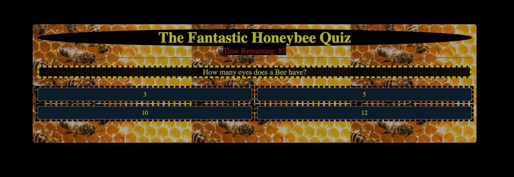
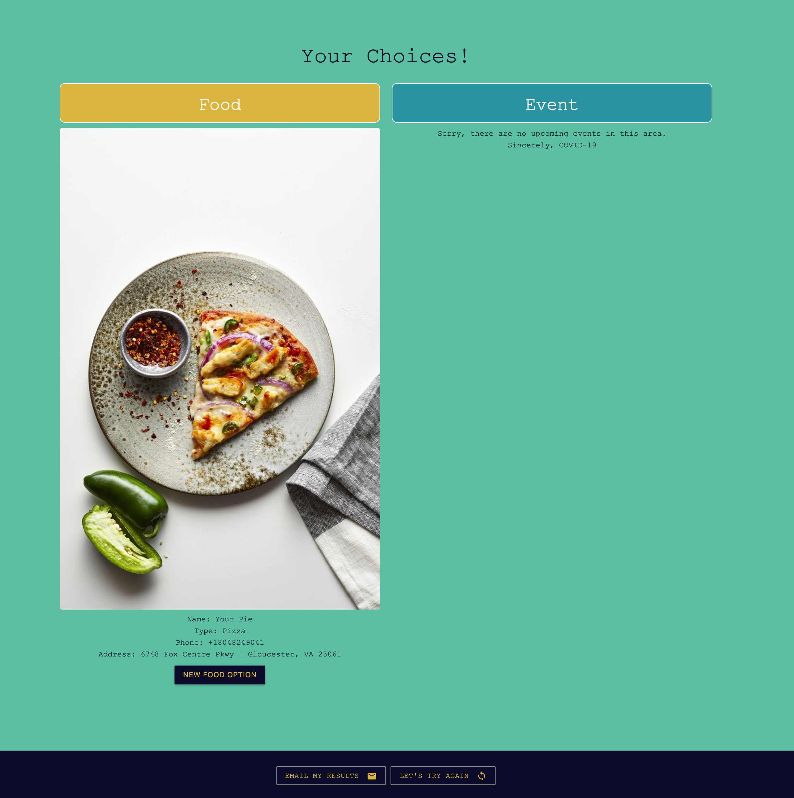
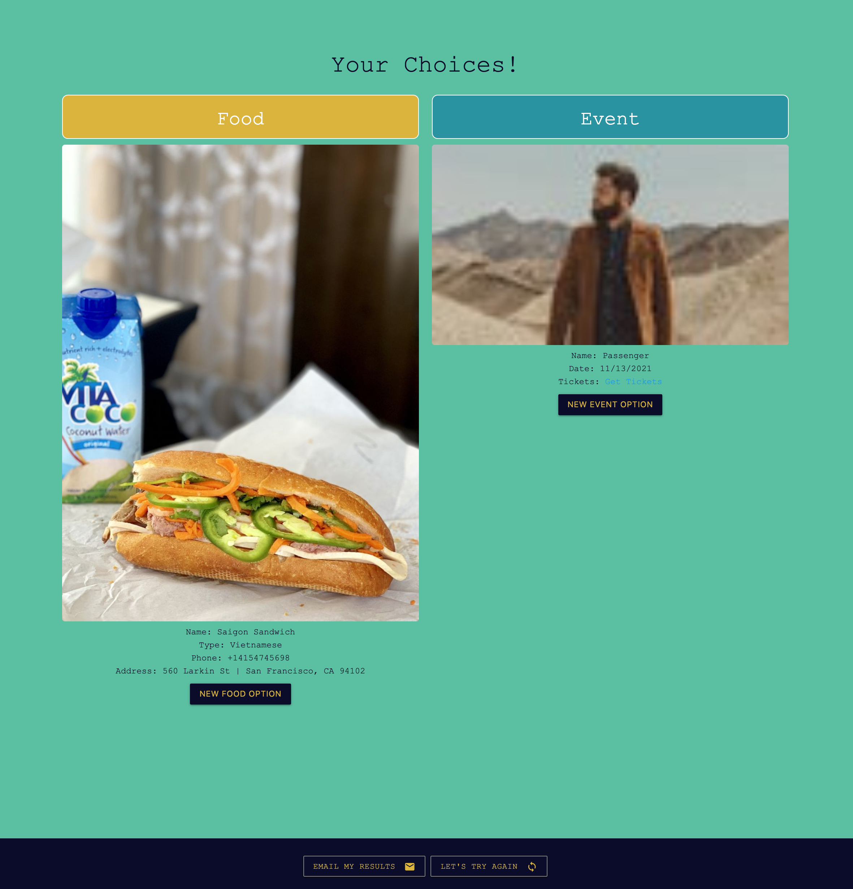
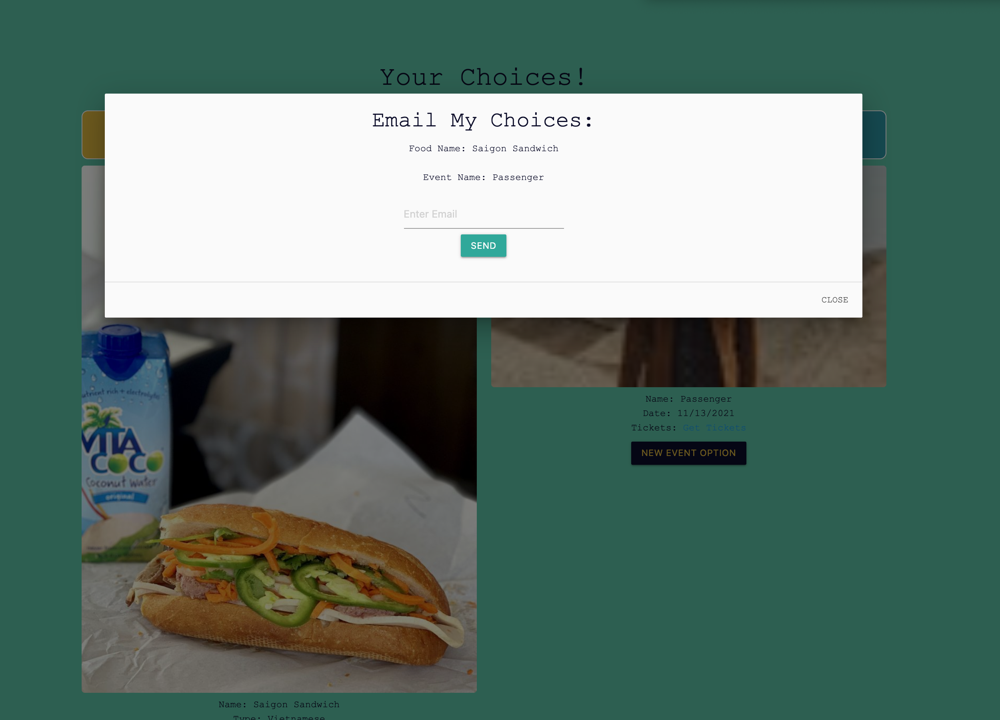

# Updated Portfolio 
- resume link
- linkedin link 
- facebook link 
- portfolio link 
- Github page 
- bio , email, number ect.

1. [Updated Portfolio](https://spental.github.io/)
2. [GitHub Profile](https://github.com/spental)
3. [Updated Resume](/Kyle_Talbott_Resume.PDF)
4. [Updated LinkedIn](https://www.linkedin.com/in/kyle-talbott-18aba91ba/)

### WEATHER DASHBOARD 
#### OVERVIEW
- The Weather Dashboard Application was designed to give the user a simple easy to use weather app for desktop or mobile devices. Weather Dashboard Application allows users to select City of Interest by entering a 5 diget zip-code. The Application will pull API data such as temperature, humidity, WindSpeed,uv index,a and current date and time. 
#### Technology Used
- HTML
- CSS
- JAVASCRIPT
- FONT-AWESOME
- BOOTSTRAP
- JQUERY
#### LINKS 
###### LINK TO RUNNING APPLICATION
- https://spental.github.io/weather-Dash/
###### LINK TO SPENTAL GITHUB ACCOUNT
- https://github.com/spental/weather-Dash
#### SCREEN SHOTS
- Working Application (Home Screen)

- Working Application (City #1 )

- Working Application (City #2)

# DayPlanner
JHU CODING BOOTCAMP - HW 5 - DAY PLANNER 
# Description 
- A simple calendar application that allows a user to save events for each hour of the work day. 
### User Story
- AS AN employee with a busy schedule
I WANT to add important events to a daily planner
SO THAT I can manage my time effectively
# Technologies 
- Font Awesome 
- bootstrapcdn
- google apis
- moment.js 
- jquery
# Screen Shots

# Links
### GitHub Page
- https://github.com/spental/DayPlanner
### Application link 
- spental.github.io/dayplanner/

# JS Quiz Game HomeWork
javascript Quiz Game with Local Storage of Scores
# Links
## Spental GitHub page 
- https://github.com/spental/HomeWork4Quiz
## Deployed Application
- https://spental.github.io/HomeWork4Quiz/
## Description 
This is a simple one page web app built to run a quiz, including a timer and score tracking and storage in Local memory.
It has been built to be fully responsive, with clean HTML and multiple JS Functions to handle logic.
## Usage 
This is a simple web app, point and click to navigate in browser.  The Quiz will run through the set of questions while tracking time to completion.  Upon reaching the end of the question set or running out of time, the game over logic will run, showing the user's score for the current session, and allowing them to save the score to local memory if desired.  
The user can also check the list of high scores saved in local memory before playing the game.

# Let's Plan a Day
JHU Coding Bootcamp-Project 1 (Anthony, Jackie, Kyle, Nick)
### Description
- The concept for Let’s Plan A Day App is to help users connect to random events and locations based off user's zip code, Users can refresh results until satisfied. Users can email event/restaurant details to specifed recipient.
### Technologies:
- HTML5
- CSS
- Javascript
- jQuery
- Materialize CSS
- Yelp (API)
- Ticket Master (API)
### Screenshots
- Home page
 
- Results Page
 
  
- Email Results
 
### Links
#### Link to GitHub
- https://github.com/nvandenberge/Project-1
#### Link to Application
- https://nvandenberge.github.io/Project-1/